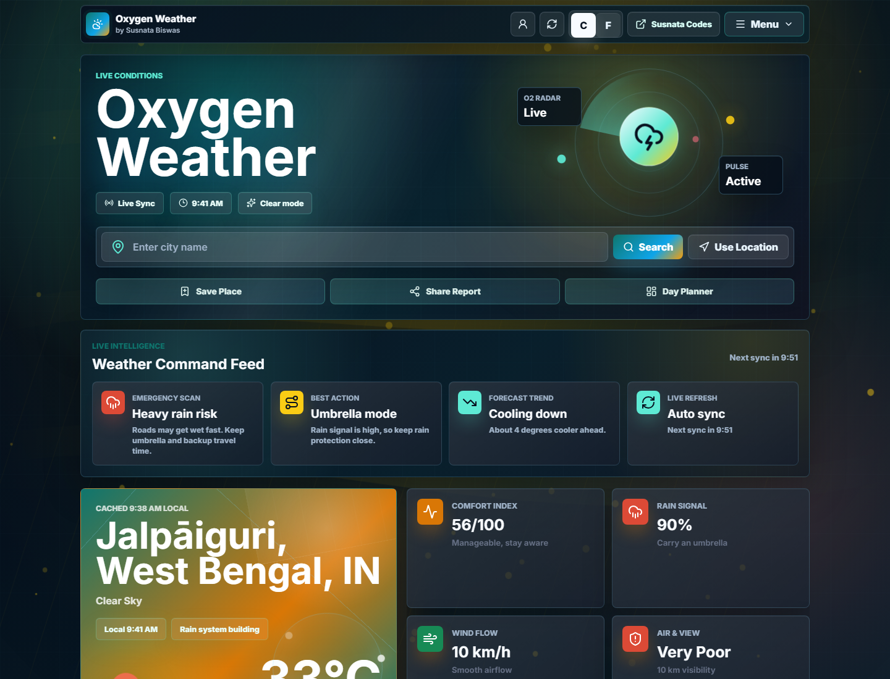

# Oxygen Weather

Oxygen Weather is a professional weather intelligence web app by Susnata Biswas and Susnata Codes. It combines a polished animated frontend, a secure Node.js/Express backend, OpenWeather data, Blogger publishing, Render deployment, Brevo email delivery, Google login, location detection, contact fallback, and automatic weather report logic.

The public frontend is designed to live on Blogger:

[oxygen-weather.blogspot.com](https://oxygen-weather.blogspot.com/)

The Render service is used as the private backend API for weather, email, subscriptions, and scheduled reports:

[susnata-weather-app.onrender.com](https://susnata-weather-app.onrender.com/)

## Desktop Screenshot

Only the desktop version is shown here.



## Project Highlights

- Professional animated weather dashboard with glass UI, radar hero, live command feed, current conditions, metrics, forecast, air quality, and footer navigation.
- Automatic local weather loading when the browser already has location permission.
- Default Jalpaiguri weather when location permission is not granted yet.
- Manual city search and "Use Location" permission button.
- OpenWeather-powered server API with private API key protection.
- Open-Meteo browser fallback when the Render backend is asleep or unavailable.
- Last successful weather report saved in local storage as an emergency backup.
- Google login UI with remembered profile and session expiry behavior.
- Gmail-style weather reminder subscription section with important alerts, test emails, daily history reports, and unsubscribe links.
- Contact form with Brevo email delivery and Gmail/mailto fallback when the backend is sleeping.
- Live earthquake monitor embedded inside the weather app.
- Blogger XML theme generator for publishing the full app on `oxygen-weather.blogspot.com`.
- Render Free support with keep-alive configuration and external cron support.
- Professional responsive footer linked to Oxygen Blog, Susnata Blog, and Susnata Codes.

## Tech Stack

| Layer | Technology |
| --- | --- |
| Frontend | HTML, CSS, JavaScript |
| UI icons | Lucide icons |
| Weather backend | Node.js, Express, Axios |
| Main weather source | OpenWeather API |
| Backup weather source | Open-Meteo public API |
| Email delivery | Brevo HTTPS email API, optional SMTP fallback |
| Login | Google OAuth Client ID plus local profile/session storage |
| Hosting frontend | Blogger theme XML |
| Hosting backend | Render web service |
| Deployment config | `render.yaml` |

## Live Architecture

```text
Visitor browser
  |
  | opens
  v
Blogger frontend at oxygen-weather.blogspot.com
  |
  | weather/contact/mail requests
  v
Render Express backend
  |
  | private API key
  v
OpenWeather API

Render backend
  |
  | contact, confirmation, alert, daily report email
  v
Brevo HTTPS email API

If Render is asleep:
  Blogger frontend -> Open-Meteo backup weather
  Blogger contact form -> Gmail or mail app draft fallback
```

## Full Working Flow

1. The visitor opens `https://oxygen-weather.blogspot.com/`.
2. Blogger loads the Oxygen Weather markup, CSS, and JavaScript from the XML theme.
3. The app checks browser geolocation permission.
4. If location permission is already granted, it loads the visitor's local weather automatically.
5. If permission is not already granted, the app keeps the default Jalpaiguri weather and the "Use Location" button can request location later.
6. For normal weather requests, the frontend calls the Render backend `/weather` endpoint.
7. The backend keeps the OpenWeather API key private, calls OpenWeather, normalizes the response, caches it, and sends clean data to the frontend.
8. The frontend renders the radar hero, live intelligence feed, current weather, forecast, air quality, planner, favorites, mail section, contact section, and footer.
9. If Render is sleeping or unreachable, the frontend switches to Open-Meteo backup weather in the browser.
10. If backup weather also fails, the app can show the last successful weather report saved in local storage.
11. Contact messages first try Render plus Brevo email delivery.
12. If contact email cannot reach Render, the app opens a prefilled Gmail/mail draft so the user can still send the message.
13. Mail alerts create a backend subscription with email, location, alert preferences, daily report time, and unsubscribe token.
14. The backend scheduler checks subscriptions, stores hourly history samples, sends urgent alerts only when important, and sends daily reports around the selected time.

## Important Features

### Weather Dashboard

- Current temperature and condition
- Feels-like temperature
- Humidity, pressure, visibility, wind, cloud cover, sunrise, sunset
- Forecast cards
- Air quality section
- Live local clock
- Weather-reactive page title
- Recent searches
- Favorite places
- Smart brief and command feed
- Planner and risk cards

### Automatic Location

The app does not force a permission popup on first load. It checks whether the browser already has geolocation permission:

- Permission already granted: load local weather automatically.
- Permission not granted: keep default weather and let the user press "Use Location".
- Permission denied: show a friendly message and keep city search available.

### Email And Contact

The recommended free email setup is Brevo because Render Free commonly blocks direct SMTP ports. The app supports:

- Contact form delivery to `CONTACT_EMAIL`
- Mail alert confirmation email
- Send Test weather report
- Important weather alerts
- Daily history report
- After-midnight outlook
- Unsubscribe link
- Gmail/mailto fallback for contact when Render is sleeping

### Blogger Backup Mode

Blogger itself does not sleep. The static frontend stays available. Render can sleep on the free plan, so the app includes backup behavior:

- Weather tries Render/OpenWeather first.
- Weather falls back to Open-Meteo in the browser.
- Last successful weather data can be reused from local storage.
- Contact falls back to a Gmail/mail draft.

Render is still required for secure server features such as Brevo API keys, saved mail subscriptions, automatic reports, and urgent alert scheduling.

## How I Made It

1. Built the frontend shell in `public/index.html` with a dashboard structure, header actions, search, command buttons, weather panels, mail alerts, contact, and footer.
2. Designed the visual system in `public/style.css` with glass panels, radar animation, weather effects, responsive layouts, desktop polish, and phone fixes.
3. Added frontend behavior in `public/script.js` for city search, location detection, unit switching, login state, favorite places, recent searches, contact fallback, mail alerts, and weather rendering.
4. Built the backend in `WeatherServer/server.js` using Express, Axios, caching, CORS protection, contact rate limiting, OpenWeather requests, mail delivery, scheduler logic, and keep-alive.
5. Added Brevo email API support because it works on Render Free through HTTPS.
6. Added Open-Meteo backup weather so Blogger can still show weather when Render is asleep.
7. Added Google OAuth configuration for a professional account chooser login flow.
8. Added `scripts/generate-blogger-theme.js` to convert the app into a Blogger-compatible XML theme.
9. Published the generated XML to Blogger so `oxygen-weather.blogspot.com` becomes the main frontend.
10. Kept Render as the backend API only, with `PUBLIC_APP_URL` pointing visitors back to Blogger.
11. Captured the desktop screenshot in `docs/screenshots/oxygen-weather-desktop.png`.
12. Wrote this README and the slide-style presentation in [docs/presentation.md](docs/presentation.md).

## Project Presentation

Use [docs/presentation.md](docs/presentation.md) as a full presentation script. Short version:

1. Title: Oxygen Weather by Susnata Codes.
2. Problem: ordinary weather apps look basic, depend too much on one server, and do not help users with important alerts.
3. Solution: Blogger frontend plus Render backend, weather backup, email reports, Google login, and professional dashboard UI.
4. User flow: open site, search city or use location, view weather intelligence, subscribe to alerts, contact support.
5. Technical flow: Blogger frontend calls Render, Render calls OpenWeather and Brevo, browser falls back to Open-Meteo.
6. Reliability: Blogger stays online, Render has keep-alive support, and contact has Gmail draft fallback.
7. Result: a full weather product, not just a simple weather card.

## Local Setup

Clone the repository:

```bash
git clone https://github.com/SUSNATACODES/SUSNATA-WEATHER-APP.git
cd SUSNATA-WEATHER-APP
```

Install backend dependencies:

```bash
cd WeatherServer
npm install
```

Create `WeatherServer/.env`:

```env
API_KEY=your_openweather_api_key
PORT=3000
PUBLIC_APP_URL=http://localhost:3000
```

Optional Brevo email setup:

```env
BREVO_API_KEY=your_brevo_api_key
BREVO_SENDER_EMAIL=verified_sender_email@gmail.com
BREVO_SENDER_NAME=Oxygen Weather
CONTACT_EMAIL=your_contact_destination@gmail.com
```

Optional Google login:

```env
GOOGLE_CLIENT_ID=your_google_oauth_client_id
```

Start the server:

```bash
npm start
```

Open:

```text
http://localhost:3000
```

## Render Deployment

The project includes `render.yaml`. Render should use:

```text
rootDir: WeatherServer
buildCommand: npm install
startCommand: npm start
```

Recommended Render environment variables:

```env
API_KEY=your_openweather_api_key
PUBLIC_APP_URL=https://oxygen-weather.blogspot.com
BREVO_API_KEY=your_brevo_api_key
BREVO_SENDER_EMAIL=verified_sender_email@gmail.com
BREVO_SENDER_NAME=Oxygen Weather
CONTACT_EMAIL=your_contact_destination@gmail.com
MAIL_CRON_SECRET=optional_private_scheduler_secret
GOOGLE_CLIENT_ID=your_google_oauth_client_id
KEEP_ALIVE_ENABLED=true
KEEP_ALIVE_URL=https://susnata-weather-app.onrender.com/health
KEEP_ALIVE_INTERVAL_MS=300000
CORS_ALLOWED_ORIGINS=https://oxygen-weather.blogspot.com,https://www.oxygen-weather.blogspot.com,http://127.0.0.1:5179
```

Health check:

```text
https://susnata-weather-app.onrender.com/health
```

Mail status check:

```text
https://susnata-weather-app.onrender.com/mail-alerts/status
```

## Blogger Deployment

Generate the Blogger XML:

```bash
node scripts/generate-blogger-theme.js
```

The output file is:

```text
blogger/oxygen-weather-blogger-theme.xml
```

Publish it:

1. Open Blogger.
2. Go to Theme.
3. Back up the current theme.
4. Open Edit HTML.
5. Replace the theme XML with `blogger/oxygen-weather-blogger-theme.xml`.
6. Save.
7. Open `https://oxygen-weather.blogspot.com/`.

## Google Login Setup

Create a Google OAuth Web application client in Google Cloud.

Authorized JavaScript origins:

```text
https://oxygen-weather.blogspot.com
http://127.0.0.1:5179
http://localhost:3000
```

Authorized redirect URIs:

```text
https://oxygen-weather.blogspot.com/
http://127.0.0.1:5179/
http://localhost:3000/
```

Add the OAuth client ID to Render as `GOOGLE_CLIENT_ID` and to the static config if needed.

## Midnight Reports And Cron

Render Free can sleep, so midnight reports are strongest when an external cron service calls the backend regularly.

Cron endpoint:

```text
https://susnata-weather-app.onrender.com/mail-alerts/cron
```

With a secret:

```text
https://susnata-weather-app.onrender.com/mail-alerts/cron?secret=YOUR_SECRET
```

Recommended interval:

```text
Every 10 to 15 minutes
```

The backend only sends reports or urgent alerts when they are due, so repeated cron pings should not spam subscribers.

## Repository Structure

```text
SUSNATA-WEATHER-APP/
  blogger/
    oxygen-weather-blogger-theme.xml
  docs/
    presentation.md
    screenshots/
      oxygen-weather-desktop.png
  public/
    index.html
    script.js
    style.css
  scripts/
    generate-blogger-theme.js
  WeatherServer/
    server.js
    package.json
    package-lock.json
    data/
  render.yaml
  README.md
```

## Security Notes

- Do not commit real API keys, Gmail app passwords, Brevo API keys, or OAuth secrets.
- Keep OpenWeather and Brevo secrets only in Render environment variables.
- Use Brevo HTTPS email delivery on Render Free.
- Use `MAIL_CRON_SECRET` if the cron endpoint is public.
- If any password was ever posted publicly, revoke it and create a new one.

## Author

Developed by Susnata Biswas.

Project brand: Susnata Codes.
